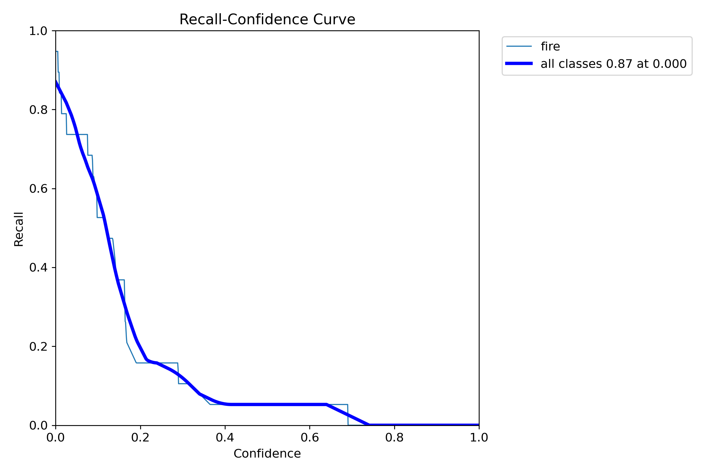
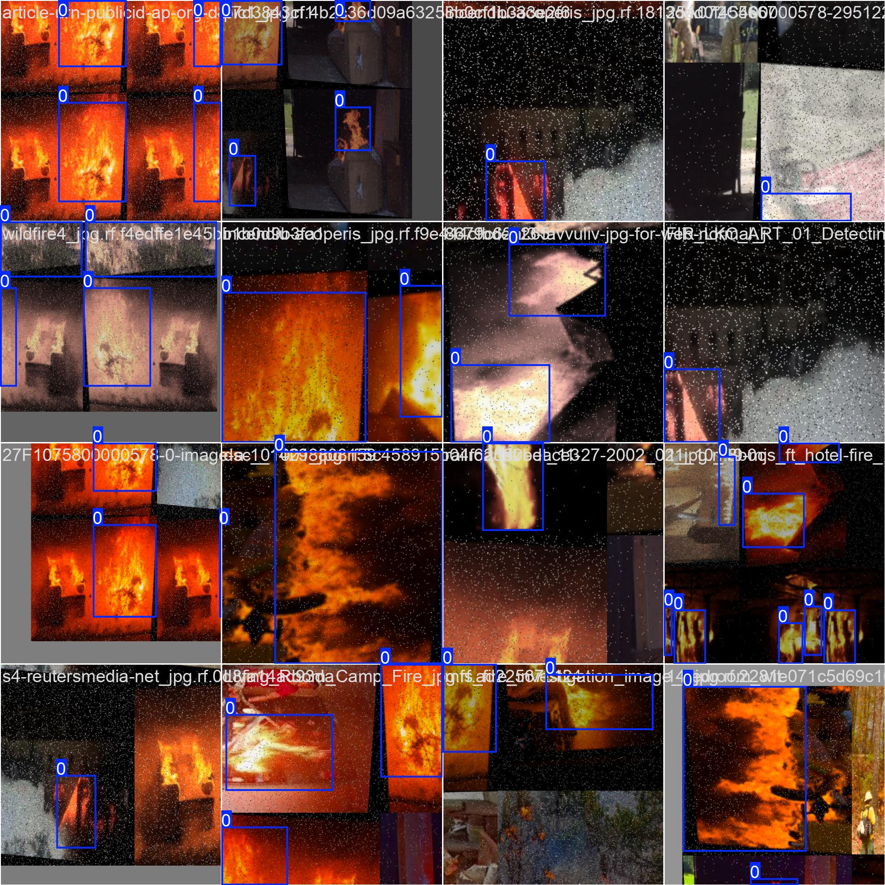
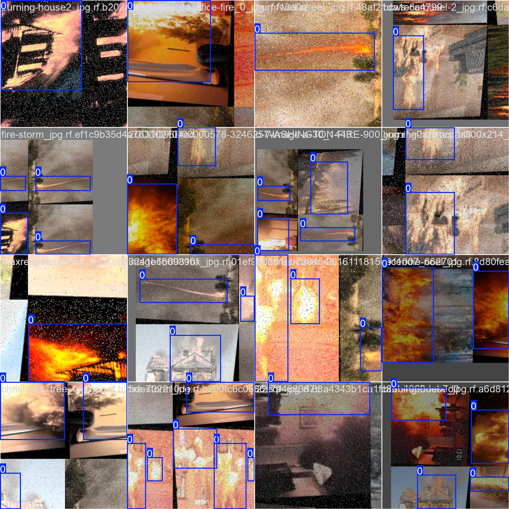
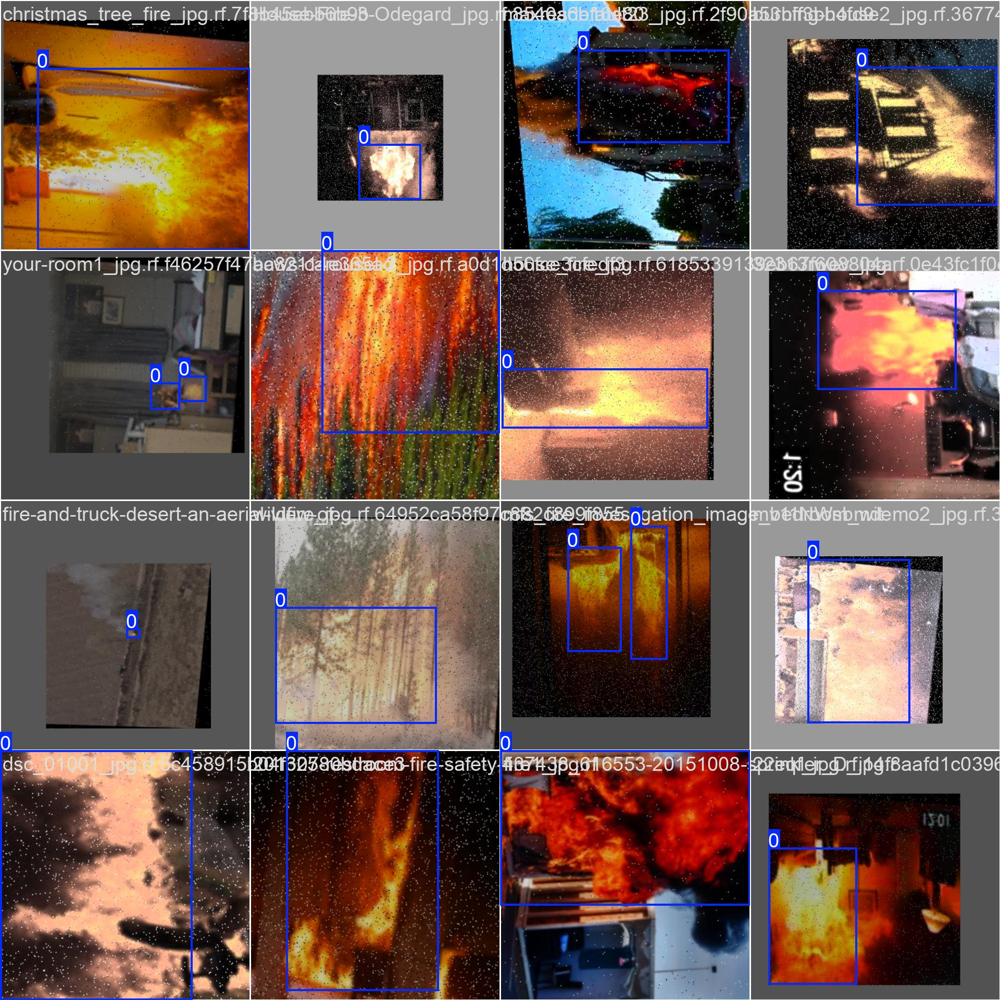

#  Fire and Smoke Tracking and Detection using YOLOv8

This project focuses on real-time fire and smoke detection and tracking in videos using the YOLOv8 object detection model. The model is trained on a custom annotated dataset to identify and track fire and smoke accurately using Python, OpenCV, and Ultralytics' YOLOv8 framework.

##  Features
- Real-time detection and tracking of fire and smoke.
- Trained on a custom dataset annotated using Roboflow.
- Uses YOLOv8 for high accuracy and speed.
- Runs inference on videos or image streams.
- Compatible with GPU (CUDA) acceleration.

##  Tech Stack
- **Language:** Python
- **Libraries:** OpenCV, Ultralytics (YOLOv8), Roboflow
- **Environment:** Google Colab (for training), Local Python (for inference)
- **Dataset Source:** Kaggle and Roboflow (custom-labeled)

##  Requirements
Install the required libraries using:

```bash
pip install ultralytics roboflow opencv-python
````

> Optional: Install CUDA if using GPU acceleration.

##  Dataset Preparation

The dataset was manually labeled and uploaded to Google Drive. It was then mounted in Google Colab for training. The annotations were already in YOLOv8 format, and the structure followed the expected format for YOLO training (images and corresponding `.txt` label files).

##  Training the Model

Training was done on Google Colab using GPU. The steps are:

```python
# Check GPU status
!nvidia-smi

# Install Ultralytics YOLOv8
!pip install ultralytics

# Import YOLO module
from ultralytics import YOLO

# Train the model
!yolo task=detect mode=train model=yolov8n.pt data=/content/drive/MyDrive/archive/data.yaml epochs=15 imgsz=640


## Evaluation

Training results such as loss curves and mAP scores are shown below:


## 🧪 Inference

Use the trained weights to perform inference on videos:

```bash
yolo task=detect mode=predict model=best.pt conf=0.25 source=fire3.mp4 save=True
```

* `source` can be a video file or image folder.
* Output is saved in `/runs/predict/`.

### Confusion Matrix:


### Training Curves:

<div style="display: flex; justify-content: space-between;">
   
   
</div>


### Sample Output:

<div style="display: flex; justify-content: space-between;">
  
  
  
</div>

### Fire Detection Demo Video:


▶️ [Watch Demo on YouTube](https://youtu.be/GwHVa75NeaQ?feature=shared)


## 🎥 Demo

[https://user-images.githubusercontent.com/22887323/216410880-297f4408-8d22-47a1-b894-6f3f3d8109fb.mp4](https://user-images.githubusercontent.com/22887323/216410880-297f4408-8d22-47a1-b894-6f3f3d8109fb.mp4)

##  References

* [Ultralytics YOLOv8](https://github.com/ultralytics/ultralytics)
* [Roboflow Dataset Annotation](https://roboflow.com/)
* [Kaggle Datasets](https://www.kaggle.com/)
* [YOLOv8 Paper](https://arxiv.org/abs/2004.10934)

---

##  License

This project is open-source and available under the [MIT License](LICENSE).


